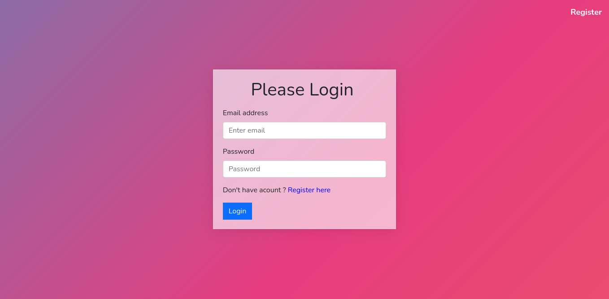
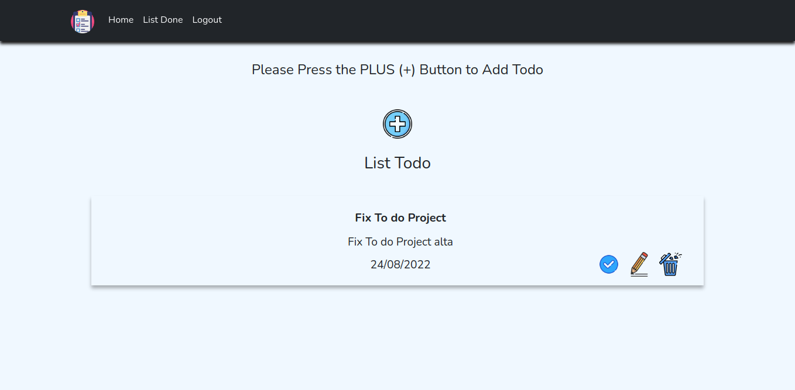
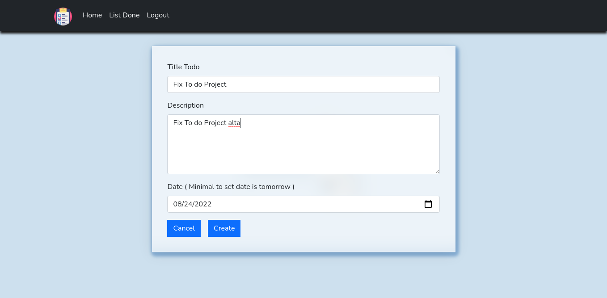

<div align="center">

<!-- PROJECT LOGO -->


</div>

# To Do List Web App

<table>
<tr>
<td>
To Do List Web App is a personal web app that allows users to make scheduling notes about what things will be done
<br/>
Back-end : <a target="_blank">https://github.com/lukmanbayhaqi/todo-server</a> 
</td>
</tr>
</table>

## Demo

Here is a working live demo : https://todo-list-app-rizalyoga.vercel.app

## 🔮 Features

- Register & login account
- Create todo list
- Edit todo list
- Delete todo list
- logout account

## Site

### Login page



### List To Do



### Surah Page



## Run in locale

To clone and run this website, you'll need [Git](https://git-scm.com) and [Node.js](https://nodejs.org/en/download/) (which comes with [npm](http://npmjs.com)) installed on your computer. From your command line:

```bash
# Clone this repository
$ git clone https://github.com/rizalyoga/todo-list-app.git

# Go into the repository
$ cd todo-list-app

# Install dependencies
$ npm install

# Run the app
$ npm run start
```

## Built with

- [React JS](https://reactjs.org/) - React is a free and open-source front-end JavaScript library for building user interfaces based on UI components. It is maintained by Meta and a community of individual developers and companies..

- [Vercel](https://vercel.com/) - Vercel is the best place to deploy any frontend app. Start by deploying with zero configuration to our global edge network. Scale dynamically to millions of pages without breaking a sweat.

- [React-Bootstrap](https://react-bootstrap.github.io/) - React-Bootstrap is a complete re-implementation of the Bootstrap components using React.

- [React-Redux](https://react-redux.js.org/) - Redux itself is a standalone library that can be used with any UI layer or framework, including React, Angular, Vue, Ember, and vanilla JS. Although Redux and React are commonly used together, they are independent of each other.
